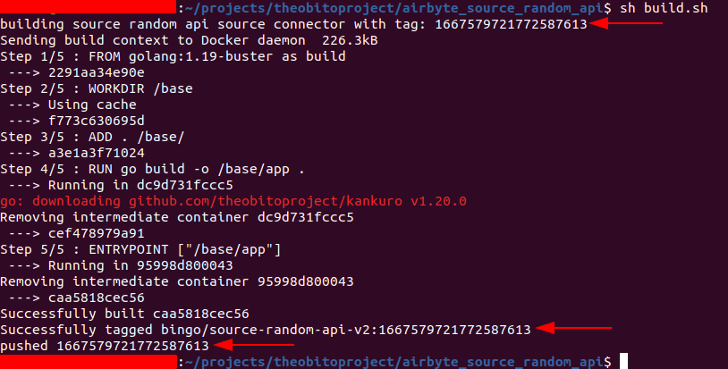

# Airbyte Source Random API with Go

Airbyte source connector made with Go to extract data from [Random API](https://random-data-api.com/).

## Usage

From the root of the project, run:

```sh
sh build.sh
```

The above command will build an image ready to use the connector. Be aware of the printed tag.

<div style="width: 500px;">



</div>

After this, the connector is ready to be used in Airbyte.
